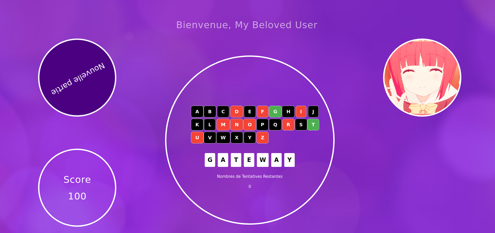

# The Hangman : A funny web version

## Installation : 
Just put the folder in your local server, and call it from the webbrowser of your choice ! 

## Note : 
This application doesn't support multi-sizing windows, and should be run in full-screen for now unfortunately :(

## To Do :
Add a support for low resolutions  
Refactor the "Play a new partie" button so that it doens't quit the current screen  
Add a "Return to sections" button  
Add an english UI translation  
